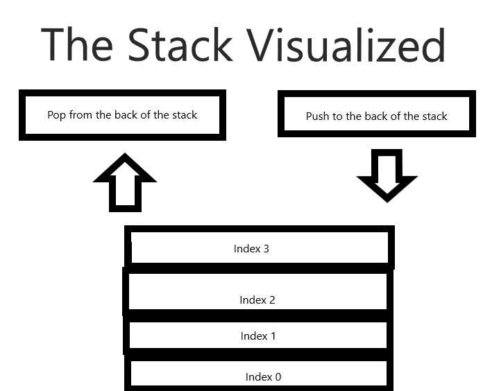
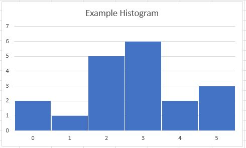
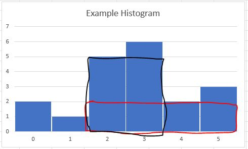
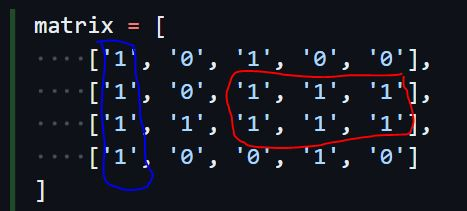

# Stacks

### Why is it Important to Know About Stacks?
---
Stop for a moment and imagine with me you’ve just gotten a new job as a developer, the job you’ve wanted for a long time, and have been assigned to help the company build what is expected to be the next big web browser. Your task is to implement the functionality for the browser to keep track of your browsing history so the user can navigate back and forth in the pages they have visited. How would you do that? What is the best way to build a browser history?

To build a history into a web browser could be likened to making a pile of books. Each time you visit a new website would be like adding a new book onto the pile. Then, when you hit the back button, it would be like pulling the book on top of the pile, which would have been the last page you went to and reload it. That is a stack. To store things with the intention of pulling them out in a first in last out pattern is exactly what a stack is built for. There is literally a prebuilt data structure in Python meant to do that very thing.

Okay, let’s try another one. You have been hired at a company building the next great office software and you have been tasked with building the undo/redo functionality. How are you going to achieve that? You guessed it, that too, is a stack.

Now here is a harder leap to make. You’ve just been hired by a company with some old programs that no one really understands anymore but everyone uses for their jobs, and which somehow developed a bug which is now preventing it from running, and they heard how good you are with analyzing code. What tool or strategy will you use to figure out how the Python interpreter would run this program? You can’t run it. There is no documentation. And to make matters worse, you are even getting conflicting information about what the program is supposed to do. For part of this, you are going to have to pull out some serious detective work. When it comes to function calls and processing the various arguments that are fed into each function, knowing how stacks work will be critical to understanding this mess of code standing before you which your job and reputation is now riding on.
Each of these examples, and many more, are why it is important to know about stacks.

### What is a Stack?
---
In the Python programming language, a stack (at least for our purposes) is represented by a list. If you want to explore some other stack type data structures, you can research into `Collections.deque` and `queue.LifoQueue`. A list is declared using a pair of square brackets. For example:

```python
sampleList = []
```

A list is a sequential block of data that can be accessed through indexes starting from 0. As mentioned above, it is also built with the idea of being used with a last in, first out methodology.

If we were to create a simple visualization for a stack it might look like this:



### Python Related Stack Commands
---
| Common Stack Operation | Description                                              | Python Code            | Performance                                                    |
| ---------------------- | -------------------------------------------------------- | ---------------------- | -------------------------------------------------------------- |
| push(value)            | Adds "value" to the back of the stack.                   | my_stack.append(value) | O(1) - Performance of adding to the end of a dynamic array     |
| pop()                  | Removes and returns the item from the back of the stack. | value = my_stack.pop() | O(1) - Performance of removing from the end of a dynamic array |
| size()                 | Return the size of the stack.                            | length = len(my_stack) | O(1) - Performance of returning the size of the dynamic array  |
| empty()                | Returns true if the length of the stack is zero.         | if len(my_stack) == 0: | O(1) - Performance of checking the size of the dynamic array   |

And just like there are more data structures in Python that can be used to represent the stack, there are also more commands and more ways to use these commands than what we have shown here. This is simply enough to get you started. If you want to dig deeper into the possible commands you can use relating to lists, then we recommend [starting here](https://docs.python.org/3/tutorial/datastructures.html). 

Table sourced from [BYU-I CSE 212](https://byui-cse.github.io/cse212-course/lesson03/03-prepare.html)

### Examples of Stacks
---
This, admittedly simple example, is what the foundation of code that you might write to store browser history might look like:

```python
# Create an empty list to store the history
history = []

def addToHistory(site):
    # Add the site to the history list
    history.append(site)

# Add some visited URLs to the history using the function
addToHistory('https://www.example.com')
addToHistory('https://www.anotherexample.com')

# Print the history
print(history)

# Output: ['https://www.example.com', 'https://www.anotherexample.com']

```

Obviously we would need to add a lot more functionality to it before it would actually be useable, but it at least gets us an idea.

And this is a simple example of how the start to implementing the undo and redo options using python might look like:

```python
# Create two lists to store the history and the redo stack
history = []
redo_stack = []

def undo():
    if len(history) > 0:
        # Pop the last action from the history and add it to the redo stack
        last_action = history.pop()
        redo_stack.append(last_action)

def redo():
    if len(redo_stack) > 0:
        # Pop the last action from the redo stack and add it back to the history
        last_action = redo_stack.pop()
        history.append(last_action)

# Example usage:

# Add some actions to the history
history.append('Type "Hello"')
history.append('Type "World"')

# Undo the last action
undo()

# Redo the last action
redo()

# Print the history and redo stack
print(history) # ['Type "Hello"', 'Type "World"']
print(redo_stack) # []
```

### Digging Deeper into Stacks
---
So, let's try to solve a problem together. This problem, (and the other problems we will solve), will not necessarily have a real-world application to them, but that is not the point. The point in this case is to help us master the use of stacks and gain a deeper understanding of how they behave in different circumstances. Then, when we run into something similar in real life, we can apply that lesson to help us solve that problem.

For this problem, we are going to be analyzing a string of characters to see if there is an even set of opening and closing brackets in each string. The goal will be to take in a string like this "{[()]}" and confirm that it has a proper set of opening and closing brackets and be able to take in a string like this "{[(])}" and realize that it does not have a proper set of opening and closing brackets.
To start with, we first need to make sure we understand what our goal is and build a plan how to get there. Our goal is to take in a string and produce a true or false statement declaring whether the string has a properly balanced set of opening and closing brackets. In a properly formatted set of opening and closing brackets, the opening bracket would always come first and then the closing bracket. In this case, while we will not always know the order the brackets will come in, we know that they should come in an easily stackable set of opening brackets. So, we first iterate through the string and add any opening brackets to the stack, and then, when we find a closing bracket, check if the opening is at the end of the stack and remove it. From there, if we have any characters left in the stack at the end of the string or have a closing bracket without any opening brackets, then we know the string of brackets is not balanced. That sounds like a good strategy to me. So, let's get that mapped out.

```Python
# Initialize an empty stack

# Iterate over each character in the input string

# Check if the character is an opening bracket

# Push opening bracket onto the stack

# Check if the character is a closing bracket

# Check if the stack is empty

# Return false because the string is not balanced

"""
Begin checking for balanced strings
At this point, all of the opening brackets should be in the stack
The current character will be a closing bracket
And we will need to make sure the current closing bracket is the same
as the last opening bracket we added to the stack
"""
# Pop top opening bracket of stack

# Check if bracket is not matched set

# Return false if it is not a matched set

# Return true if stack is empty because the string is balanced
```

Now, to be honest, before writing this outline, I had already gotten the whole solution, so, if your outline is not as refined, don't feel bad. From here, once you have your plan in place, we can build our solution which could look like this:

```Python
def isBalanced(bracketString):
    # Initialize an empty stack
    bracketStack = []
    # Iterate over each character in the input string
    for character in bracketString:
    # Check if the character is an opening bracket
        if character in '({[':
            # Push opening bracket onto the stack
            bracketStack.append(character)
        # Check if the character is a closing bracket
        elif character in ')}]':
            # Check if the stack is empty
            if not bracketStack:
                # Return false because the string is not balanced
                return False
            """
            Begin checking for balanced strings
            At this point, all of the opening brackets should be in the stack
            The current character will be a closing bracket
            And we will need to make sure the current closing bracket is the same
            as the last opening bracket we added to the stack
            """
            # Pop top opening bracket of stack
            top = bracketStack.pop()
            # Check if bracket is not matched set
            # Return false if it is not a matched set
            if character == ')' and top != '(':
                return False
            elif character == '}' and top != '{':
                return False
            elif character == ']' and top != '[':
                return False

    # Return true if stack is empty because the string is balanced
    return not bracketStack


print(isBalanced("{[()]}")) # True - This string has matching brackets
print(isBalanced("{[(])}")) # False - This string has unmatched brackets
```

This code will successfully test most every combination of opening and closing brackets fed into the function as a single string. Now, try this next problem on your own and check how we did it after you've worked out your own solution.

### Digging Even Deeper into Stacks
---
For this problem, your goal is to take a list of numbers that represent a histogram and find the largest rectangle. In this case, the histogram would look like this:



The number in index 0 would create a bar with a width of 1 and a height of 2. The number in index 1 would form a bar with a width of 1 and a height of 1 and so forth.
The goal is to find the largest rectangle that can be made from the combined bars of the histogram. In this case, there are two large rectangles that can be found (Circled in red and black).



The red rectangle has a height of 2 and width of 4 (area 8) while the black rectangle has a height of 5 and a width of 2 (area 10). Your goal would be to write code that would find the rectangle with the largest area; in this case, the black rectangle with an area of 10.

```Python
def largestRectangleArea(histogram):
    # Enter your code here
    return maxArea

print(largestRectangleArea([2, 1, 5, 6, 2, 3])) # 10
```
Once you have your solution implemented, check how we did it and see how they compare. Are there any changes you would make to your solution after seeing ours? Are there any improvements you can think of for how to improve our solution? If you analyze both solutions, what would be the big O notation for both?

[Solution](largestRectangleArea.py)

Do you see areas you can improve? Did you get new ideas of how to implement it differently than either how we did or how you did and what, of those, would you think would be the most efficient and why? Stopping and asking questions like these are important to help you become a better programmer.
Now that you have built a good foundation into understanding Stacks, if you are up for an even bigger challenge, try this next challenge and join the discussion about it afterwards.

### Digging Even Deeper Still into Stacks
---

For this challenge, your goal is to take a matrix of 1's and 0's and find the area of the largest rectangle that is constructed by 1's. For example, in the matrix for this problem, there are a few possible rectangles. In the two possible rectangles we have highlighted in this example, the blue rectangle would have a width of 1 and a length of 4 giving it an area of 4, while the red rectangle would have a width of 3 and a height of 2, giving it an area of 6.



And while there are many other possible rectangles in this matrix, the one with the largest area is the red rectangle, with an area of 6. Your goal is to write code that could be fed a matrix of an unknown size that consists of 1’s and 0’s and find the largest rectangle made up of 1’s. We were able to solve it with the two functions we reference in the code segment below along with their arguments. If you need to modify the arguments or add/remove functions to solve the problem, that is just fine. If you can feed in any matrix and get the correct answer, then it is a good solution. We can always improve the code later. And remember, the goal of this exercise is both to learn how to solve problems and become more familiar with how stacks work, so you can better use them to solve problems in the future.

```Python
def largestRectangleArea(histogram):
    # Enter your code here

    return max_area

def maximalRectangle(matrix):
    # Enter your code here

        max_area = max(max_area, largestRectangleArea(histogram))
    return max_area

matrix = [
    ['1', '0', '1', '0', '0'],
    ['1', '0', '1', '1', '1'],
    ['1', '1', '1', '1', '1'],
    ['1', '0', '0', '1', '0']
]
print(maximalRectangle(matrix)) # 6
```

Once you found a solution to this problem, join the discussion about it, and see how your solution compares to everyone else. Learning can be a community activity as well as an individual one.

[Back to Welcome Page](0-welcome.md)
