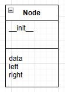
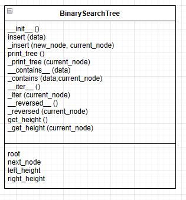

# Binary Search Trees

### Why is it Important to Know About Binary Search Trees?
---

A properly implemented Binary Search Tree will operate in O(log n) time. This means that the time taken to sort through a Binary Search Tree grows slowly compared to the size of the data. For example, if you had a book containing every word in the English language translated to French, that would potentially take a long time to find the word you needed if you had to flip through page by page. 

What a Binary Search Tree does is that it takes half the data, put it on one side of the tree, and then puts the other half on the other side. It, then, repeatedly does that to smaller and smaller segments of the data. The effect of this means that you can quickly filter out large portions of the data you are filtering through. With your book, it would be like flipping halfway through the book, stopping to figure out if your word is on the page, and, if not, figuring out if your word would come before or after the page you are on, and then repeating that same process, slowly getting to smaller and smaller chunks of pages until you finally found your word. 

Whether you are building a simple app that requires a user to login to access something, a large database that needs to quickly sort through large amounts of data, a computer simulation, or really anything that needs to store, search, or retrieve large amounts of data in an ordered manner can benefit from using a Binary Search Tree. If you are going to be working with large amounts of data of any kind, then you need to know about Binary Search Trees. 

### What is a Binary Search Tree?
---

Generically speaking, a Binary Search Tree is a program that implements the Binary Search Algorithm. The steps of building a Binary Search Tree are simple but first require a sorted dataset before you begin. And, before we explain what a Binary Search Tree is, we need to make sure to define a few concepts.

Tree
: The Binary Search Tree

Node
: A data structure within the Binary Search Tree that stores the actual data and keeps track of the links to other nodes that connect to this node. 

Root
: The initial node added to a Binary Search Tree that all data will be compared to.

Branch
: A node with at least one more node attached underneath it. 

Leaf
: A node with no other nodes attached beneath it. 

Child
: A node (either on the left or the right) attached beneath another node.

1. Start with an empty Binary Search Tree
2. Select a data point and add it to the root node of the tree
3. For each subsequent data point you add, compare it to the root node:
    - If the value is less than the root node, continue to follow the left child until you either find a value smaller than the value being added or you find a leaf node. Then, add the data as a new node with the data on the left.
    - If the value is greater than the root node, continue to follow the right child until you either find a value greater than the value being added or you find a leaf node, then add the value on the right of the node. 
4. From there, repeat step 3 with all additional data points being added. 

One of the beautiful things about a Binary Search Tree is that you can store more than just numbers. You can store anything in a Binary Search Tree that you can use the greater than `>` or less than `<` operators to compare. So, if you wanted to write a custom implementation of the `>` or `<` operators, then you could literally store anything in a Binary Search Tree. For our purposes, we will focus on numbers because they are easier to start with. 

In Python, there are no preexisting Binary Search Tree data structures. However, we can build a Binary Search Tree data structure into Python and, by the time we are done, you will have the ability to do just that. 

### How to Build a Binary Search Tree
---

The first thing you need when building a Binary Search Tree is to teach the program how to store the data and how to track the links that each data will point to. Each node will need to have two other data points it goes to - one on the left and one on the right. Common naming structure for the class we are talking about is to call it a `Node`. This means our UML diagram for the node class might look like this: 



Note: All UML diagrams made using [draw.io](https://app.diagrams.net/)

The __init__ is a built in Python method that acts as a constructor for classes in Python. 

The code for the node class might look like this: 

``` Python
class Node:
    # Defines the initial state of the Node class when created
    def __init__(self, data): 
        self.data = data # Places input data into created node
        self.left = None # Pointer to left node
        self.right = None # Pointer to right node
```
#### Planning the Binary Search Tree 
---

This class takes in the data we are trying to store in the Binary Search Tree, attaches it to the `self.data` variable, and sets up the `self.left` and `self.right` variables to store future links to data put in the left and right branches of the tree. The "self." references attach the data in question to the specific instance of that class. So, when you first create the root of the tree, the self references are what make that data uniquely stored in that specific instance of the node class. We have now told the computer how to handle the two different kinds of data we will be working with, specifically the data we will be storing, and the pointers to let us find the data. Now, we need to tell the computer how to build the actual tree and how to store and manipulate the data we will be storing. 

We can call the class that is responsible for actually building and manipulating the Binary Search Tree `BinarySearchTree`. Now, we need to figure out what we want our tree to do and how we want it to behave. The first thing we will need to do is to decide what we want it to do when we first create an instance of our class. And, for our case, we will want to create the root of the tree that everything will be built off of. From there, we need to be able to insert data into the tree, and it would be nice to print what is in the tree, and to see what is inside of the tree. It would also be nice to be able to iterate through the tree using the `for` operator and to be able to use the `reversed` method on it. It would also be fun to be able to see how many layers deep the tree is so we will want something for that. 

We will likely need to use recursion on the class methods and will likely need to have a base case for most of these methods as well. It could get really messy to have to deal with both base cases and recursion with a real possibility of changing arguments for each method between the initial call and the recursive call. So, it might be best to break these up into two methods: one public that enables the function and one private that teaches the method how to do everything but the base case. 

For each method, we will need to use the self argument to allow each instance of the class to access the attributes and methods of the class. For the public insert function, we will just need to take in the data we are trying to insert into the tree. The output for that will be the node with the data attached to it. We can also have it check to see if the root that was created in the `__init__` method is empty and, if so, just attach the node to the root. And, given we need to store the root somewhere, we will need a variable to store it in so we will call that `root`. 

From there, we will need to tell the program how to insert the node if it is not the root. For that, we will need the `new_node` and the `current_node` which will also be the root node if the tree has no other data in it. This function will not return anything; it will just insert the data into the tree in the proper place. We will also want to put a stop into the method to prevent it from adding any duplicate data. 

Next comes the `print_tree` method. We won't need to take anything into the method other than self for the public version of the method. We will just need something to check if the tree is empty and then will likely need to use recursion for the rest, which will be written in the `_print_tree` method. 

Then comes the `__contains__` method. This is enabling a default method in Python that enables us to check if data is in the `BinarySearchTree` or not. In this case, there is no base case but we also don't want to have to remember to pass in the tree when trying to check if data is inside of it. Additionally by splitting the function out, it maintains a more uniform structure for the code. So, we would just pass in the data to the `__contains__` method and then, in the `_contains` method, we would pass the tree in so we can check if the data is in there using recursion. We would be returning either true or false from both the `__contains__` and `_contains` methods. We are going to need a variable to store the next node in, so we will call it `next_node`.

Next, we would build the `__iter__` method which is a built in Python method that enables something to be iterated over. For example, while things like integers, floats and booleans are not iterable, lists, tuples, sets, dictionaries, and strings are. We definitely want our data structure to be iterable. For the `__iter__` method, we would only need to take in self. For the `_iter` method, which would do the bulk of the hard work, we would need to take in the `current_node` so we can recursively call the function. And we would create the `_iter` method to ensure we do not need to remember to pass in the tree when trying to iterate through it, thus making it easier to use. Additionally, as mentioned before, by splitting the method into two parts, it maintains a more uniform code structure. The return for both methods would be the individual data points inside of the tree. 

After that, we would work with the `__reversed__` method which is a special built in Python method that allows use of the `reversed()` function. The structure for these will be very similar to the `__iter__` and `_iter` methods. In fact, the code itself will be very similar - one will likely just need to be reversed from the other. The reason for this is based on how Python handles function calls, which you can read about in our [lesson on stacks](1-stacks.md). And like the prior two methods, the `__reversed__` and `_reversed` methods will return the individual data points of the tree but in reverse order instead of in order. 

Finally, we have the `get_height` method which lets us see how many rows are in the tree. For the `get_height` method, we will just want to have self passed in as an argument and then will pass the `current_node` in as an argument for the `_get_height` method. The return of both of these will be an integer equal to the height of the Binary Search Tree. We will need the variables `left_height` and `right_height` to store the counts of the tree in as we use recursion to count the levels. 

And while rough, that should work as a plan to get us started. The finished UML diagram might look like this: 



#### Building the Binary Search Tree
---

To start our build, we will need to declare the class and define our constructor. A quick look back at the UML diagram tells us that we did not include anything other than self for the arguments. The thing we need to make sure is done whenever creating a new `BinarySearchTree` is to create the root and set it equal to `None` and we will need it to be unique to each individual instance of the class. So, that means that we could build this portion of our class like this: 

```Python
class BinarySearchTree:
    # Defines the initial state of the Binary Search Tree upon creation
    def __init__(self): 
        # Sets the root of the tree to None
        self.root = None 
```

Our UML diagram tells us that the next step in our program is to build the insert method and that we will take in `data` in addition to `self`. We also know that we will need to create a new instance of the node class and that it will be called `new_node`. Our notes from our plan tell us that we also want to check if the tree is empty which we would do by checking if it is equal to none and then, from there, call the `_insert` method to handle every other case. And with that in mind, our code for the `insert` method could look like this: 

``` Python
    def insert(self, data): # Tells the tree how to insert data
        new_node = Node(data) # All data in Binary Search Trees are stored in nodes
        if self.root is None:
            self.root = new_node # Sets data as root if root is empty
        else:
            # determine where the node will go if not root
            self._insert(new_node, self.root) 
```

And with our insert method built, we do not even need to look at the UML diagram to know we need to build the `_insert` method next. We do need it to know that we will be adding two arguments, one called `new_node` and another called `current_node`. From our notes, we also know that we want to build something to prevent duplicate data from being added to the data structure. We want to build this so that smaller data values will be stored on the left and larger data values will need to be stored on the right. And because the data is stored within the node, that means that we will be able to use the keywords built into the Node class. We are also going to need to find a leaf in the data structure (the end of a branch) and we will need to use recursion to move from one node to the next. So, that means that we will need to use a few `if` and `else` statements. 

The first `if` will simply check if the data in the `new_node` is the same as the data in the `current_node` and then end the function. The second `if` will check if the data in the `new_node` is less than the data in the `current_node` and then, if it is, we will need a nested `if` and `else` statement. The nested `if` will check if the node on the left of the `current_node` equals `None` which would mean we have found where the data goes and then assign it. The `else` will recursively call the method beginning the check again. From there, because we have excluded the possibility of duplicate data, the only remaining possibility is that the data in `new_node` is greater than the data in `current_node`. The logic here will follow the same path as the logic for the less than cases, only it will use the right path where the other used the left path. 

And that gives us enough to build the code, which could look like this: 

``` Python
    # Separated _insert from insert to allow for cleaner use of recursion
    def _insert(self, new_node, current_node): # Determines where non-root node will go.
        if new_node.data == current_node.data:
            return  # Stops duplicate data from being added to the tree
        
        if new_node.data < current_node.data: # Check if data to be inserted is less than current_node
            if current_node.left is None: # Uses pointer in Node class to identify left node
                current_node.left = new_node # If left node is none, we have found where the data goes
            else:
                # Navigate further down the left branch of the tree using recursion
                self._insert(new_node, current_node.left) 
        else: # Used when number is greater than current node
            if current_node.right is None: # Uses pointer in node class to identify right node
                current_node.right = new_node # If the right node is empty we have found where the data goes
            else:
                # Navigate further down the right branch of the tree using recursion
                self._insert(new_node, current_node.right)
```

The next thing up on our UML diagram is our `print_tree` method. For this part of the function, we are just taking the argument of self. We will need to put code in to stop the method from trying to print an empty list and then the rest will be processed by the `_print_tree` method. We can put the print function itself in the `_print_tree` method. So, with that, our code for the `print_tree` method could look like this:

``` Python
    def print_tree(self): 
        if self.root is None: # Checks if tree is empty
            return # Stops method call by returning none
        else:
            self._print_tree(self.root) # Starts printing process
```

And with that written, the next up would be the `_print_tree` method which our UML diagram has our plans to take the current node as an argument along with self. As with the other similar methods, we will need to use recursion to call all of the nodes in the tree and will need to tell it when to stop. For this case, we are not concerned about starting at the beginning, we just want to print everything. As we discussed in our [lesson on stacks](1-stacks.md), we know that Python uses stacks to track function method calls. So, if we queue up the program to first print the current node and then recursively call both a call to the left and right nodes, it will add each of those to the stack, working through all the nodes on whichever side we list first. So, if we put the left branch first, it will first print the data on the left side of the tree and then will print the data on the right side of the tree. To achieve this, one way our code could look would be:

``` Python
    # Separated _print_tree from print_tree to allow cleaner use of recursion
    def _print_tree(self, current_node): # Defines how to print the tree
        if current_node is not None: # Prevents the program from trying to print an empty node
            print(current_node.data) # Prints data in current node
            self._print_tree(current_node.left) # Recursively moves current_node down the left branch
            self._print_tree(current_node.right) # Recursively moves current_node down the right branch
```

Continuing to follow our plan, the next up on our UML diagram is the `__contains__` method. The `__contains__` method is a built in method within Python that allow us to use the `in` and `not in` operators. And while we do not have a base case we need to worry about, putting the bulk of the code in the `_contains` method makes it easier to work with the `__contains__` method and maintains a similar structure throughout the program. And with that, our code for this method could look like this:

``` Python
    """
    The following, adds functionality to use things like the "in" keyword to check if data is in the Binary Search Tree.
    """
    def __contains__(self, data): 
        return self._contains(data, self.root)
```

So, with the `__contains__` method defined, we then will need to write the `_contains` method to formally tell the program how to tell if the tree contains the data in question. From our UML diagram, we know we will need to include both `data` and `current_node` in addition to `self` as arguments. From there, we will need to set the `next_node` variable to `None` to get it ready for later use. Then, we will check if the data we are looking for equals the data in the current node and return true if it is. Then, we need to figure out how to check if the data is not in the function and, if so, then we need to return `False`. In this case, we'll come back to that in a moment and look at the rest of the program. If the data is not in the current node and we have not ruled the data as not being in the tree, then we need to move down closer to where the data will be. That will be the same process as placing the data in the first place. So we will check if the data is larger or smaller than the data in the node we are looking at and move down the tree accordingly. So, that means, if we get to the bottom of the tree and have not found the data we are looking for, then both the right and the left nodes will be set to `None`. So, that tells us how to build our code. We would just set the next node to whatever path leads us closer to the data and recursively call the function again. With that plan in place, our code could look like this: 

``` Python
    # Separated _contains from __contains__ to allow cleaner use of recursion
    def _contains(self, data, current_node):
        next_node = None # Initialized for later use
        if data == current_node.data:
            return True # Returns true if data is found
        
        elif current_node.left == None and current_node.right == None:
            return False # Returns false if date is not found
        
        elif data < current_node.data: 
            # Sets next node to left child node if data is less than current node
            next_node = current_node.left 

        elif data > current_node.data:
            # Sets next node to right child node if data is grater than current node
            next_node = current_node.right
        
        return self._contains(data, next_node) # Recursive call to method starting from next_node
```

The next item on our UML plan is the `__iter__` method which is how we make an item iterable via the `for` keyword. And just like with the `__contains__`, we do not have a base case to worry about but, by separating out the method into two parts, it both makes it easier to implement and maintains a more uniform code structure. Accordingly, to implement this, all we need to do is to make a call to the `_iter` method; however, as we are going to be returning a series of values over time instead of just all at once, it will be better to use the `yield` keyword instead of the `return` keyword. And with that in mind, our implementation of the `__iter__` method could look like this: 

``` Python
    # Enables iteration through the tree using the for keyword
    def __iter__(self): 
        yield from self._iter(self.root)
```

And of course that means that the next item on our list is the `_iter` method to formally teach the program how to iterate through the list. From looking at our plan in the UML diagram, we know we will need to include both self and `current_node` in the arguments to the method. From there, we will take advantage of how Python handles function calls (see our [lesson on stacks](1-stacks.md) for more details) to build this method. Just like with the `__iter__` method, because we are trying to return a series of values over time, it will be better to use the `yield` keyword. We will need to put a way to stop the recursive calls to the method. We will specifically want to tell it to continue until the last node which would be easy to do through checking if the node is not `None`. From there, if we implement a recursive call to the left node attached to the current node, then yield the data from the `current_node`, and finally implement a recursive call to the node attached to the right of the `current_node`, the order of operations created by the stack will cause the program to travel all the way down to the lowest node on the left side, which will be the smallest number in the data structure, and then will stop trying to go any lower thanks to the stop we put in as the first line in the method. And from there, we will properly grab all the data from smallest to largest. And with that in mind, our code for the `_iter` method could look like this:

``` Python
    # Separated _iter from __iter__ for cleaner use of recursion
    def _iter (self, current_node): 
        # teaches the __iter__ method how to iterate through data
        if current_node is not None: # Stops the recursive calls to the method when every option is none
             # Recursively calls the function to grab the left most node
            yield from self._iter(current_node.left)
            # Returns data from current node
            yield current_node.data 
            # Recursively calls the function to grab the right most node
            yield from self._iter(current_node.right)
```

And the next item up on our UML diagram plan is the `__reversed__` method which will enable us to iterate through the code in reverse using the `reversed` function. The logic for this method exactly follows the logic from the `__iter__` method, leaving us with the following as a possible implementation of the `__reversed__` method:

``` Python
    def __reversed__(self): # Enables the reversed() keyword
        yield from self._reversed(self.root)
```

And just like the `__reversed__` followed the `__iter__` method, the `_reversed` method also follows the logic for the `_iter` method. The only difference will be that we will call the right node first and the left node last, leaving us with the following as a possible implementation of the `_reversed` method:

``` Python
    # Separated _reversed from __reversed__ for cleaner use of recursion
    def _reversed (self, current_node): 
        # Teaches the program how the reversed keyword should operate
        if current_node is not None: # Stops the recursive calls to the method when every option is none
            # Recursively calls the function to grab the right most node
            yield from self._reversed(current_node.right) 
            # Returns data from current node
            yield current_node.data 
            # Recursively calls the function to grab the left most node
            yield from self._reversed(current_node.left)
```

Finally, the last two items on our UML diagram plan are those that let us get the height of the tree. The call to `get_height` only needs self and will need a base case to stop it from trying to check the height of an empty tree. This can be done simply by checking if the root is `None`. From there, we will need to call the `_get_height` method to use recursion to handle the rest. The `get_height` method could look like this:

``` Python
    def get_height(self): # Enables the program to check 
        if self.root is None: # Default case if tree is empty
            return 0
        else:
            return self._get_height(self.root)
```

This leaves us with our final method: `_get_height`. We need to use `self` and `current_node` as arguments for the method and then we will need to stop the recursive calls to the function which can be done through checking if the `current_node` is `None`. From there, a wonderful feature of the Python language will let us count the height of the left and right trees using recursion. If we attach a recursive call to a method or function behind a variable, then each time it is called will act as a += 1 to the variable. That means we can just use `left_height` and `right_height` variables with recursive calls to the left and right nodes respectively. That will give us a count of each time the function was called on that variable. From there, we would just need to find the largest of the two and add one to it for the root node and we would have a count of the height of the tree. That would leave one possible implementation of our code looking as follows:

``` Python
    # Separated _get_height from get_height for cleaner use of recursion
    def _get_height(self, current_node):
        if current_node is None: # Stops recursive calls to function
            return 0
        else:
            # Recursively calls function adding 1 to each variable each time it is called. 
            left_height = self._get_height(current_node.left) 
            right_height = self._get_height(current_node.right)
            # Selects largest of the two variables and adds 1 for the root. 
        return max(left_height, right_height) + 1
```

### Digging Deeper into Binary Search Trees
---

Now that we know how to build a Binary Search Tree, let's dig a little deeper into that tree and try solving a few problems. For each of the problems we solve, we will need to use the Binary Search Tree we built earlier. 

Technically, one of the things our implementation of the `__iter__` method allows is the use of the `min` and `max` keywords, but, if we wanted to dig deeper into that idea and build our own custom method of finding the min and max of a Binary Search Tree, then this is how we would do it. 

For this, we should just be able to navigate down the left and right branches of the tree until we hit an end and then return the data for whatever node we stop at. We would also need to add a base case to check if the tree is empty and then we would have our solution. The only difference between finding the maximum and minimum values would be the right versus left variables. 

So, with that in mind, our outline for the methods would look something like this:

``` Python
# Check if the root of the tree is None, meaning the tree is empty

# Set the current node to the root of the tree

# Traverse the left subtree until we reach a leaf node

# Return the data of the leftmost leaf node, which is the minimum value in the tree
```

And the outline for finding the maximum value in the tree would look something like this:

```Python
# Check if the root of the tree is None, meaning the tree is empty

# Set the current node to the root of the tree

# Traverse the right subtree until we reach a leaf node

# Return the data of the rightmost leaf node, which is the maximum value in the tree
```
And while we could certainly solve this problem with recursion, a `while` loop inside of an `if` and `else` clause would solve it neatly so that is the path we are going to explore. 
```Python
    def find_minimum(self):
        # Check if the root of the tree is None, meaning the tree is empty
        if self.root is None:
            return None
        else:
            # Set the current node to the root of the tree
            current_node = self.root
            # Traverse the left subtree until we reach a leaf node
            while current_node.left is not None:
                current_node = current_node.left
            # Return the data of the leftmost leaf node, which is the minimum value in the tree
            return current_node.data

    def find_maximum (self):
        # Check if the root of the tree is None, meaning the tree is empty
        if self.root is None:
            return None
        else:
            # Set the current node to the root of the tree
            current_node = self.root
            # Traverse the right subtree until we reach a leaf node
            while current_node.right is not None:
                current_node = current_node.right
            # Return the data of the rightmost leaf node, which is the maximum value in the tree
            return current_node.data
```
To see this in a useable format, [check it out here](FindMinimum.py) along with the Binary Search Tree we built earlier. 

### Digging Even Deeper into Binary Search Trees
---

For this challenge, our goal is to be able to take a number like 4 from the user and find the value in that position either starting from the largest value or from the smallest value. For example, if we had the numbers 1 through 100 properly sorted in our tree and were given the number 4, we would be able to use the code you write to either find the number 4 or 97 in our tree. 

```Python
    def findKthSmallest(self, k):
        # Your Code goes here
        pass

    def findKthLargest(self, k):
        # Your Code goes here
        pass
```

When you're done, feel free to [check our solution here](FindKthSmallest.py). Did you find a different solution? How did the performance of your solution compare to the method we used? After looking at our solution, what improvements can you think of for either your solution or our solution?

### Digging Even Deeper Still into Binary Search Trees
---

For this challenge, our goal is to take in a value and be able to find either the next largest value from that value or the next smaller number from that value. We recommend the following code to get started on this challenge. For example, if the values 1 through 100 were put into the tree in an organized manner and we were given the number 27 as input, then we should be able to find either 28 or 26 with our code. 

```Python
    def find_next_largest (self, data):
        # Your Code goes here
        pass

    def find_next_smallest (self, data):
        # Your Code goes here
        pass
```

For the solution we implemented, we were able to use that structure. Additionally, with how our Binary Search Tree was built, we were able to do the same kind of thing we did with the `__iter__` and `__reversed__` methods and used the algorithm we built for the `find_next_smallest` method. Share your thoughts and solutions with us as we continue our efforts to dig deeper into the wonderful world of coding.

[Back to Welcome Page](0-welcome.md)